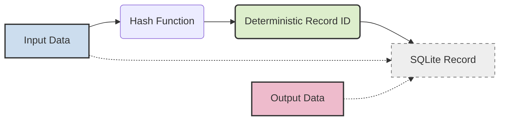

# @satios/db

[](https://badge.fury.io/js/%40satios%2Fdb)
[](https://opensource.org/licenses/MIT)
<!-- Add other relevant badges: Downloads, Build Status, etc. -->

**A simple, powerful database library designed for data pipelines and AI agents, built on SQLite.**

`@satios/db` provides a unique approach to data persistence by cleanly separating the **Input** (the immutable definition of *what* something is) from the **Output** (the mutable results or state *associated* with it). This design makes it exceptionally well-suited for tracking progress in pipelines, managing agent states, caching, and more, all with type safety provided by Zod.

## Core Design: The Input/Output Split

The fundamental innovation in `@satios/db` is its separation of data into two distinct, linked schemas:

1.  **Input Schema:** Defines the immutable, essential properties of a record. Think of this as the "natural key" or the definition of the task/entity. Examples:
    *   A specific URL for a web scraper.
    *   A unique message ID for a message queue processor.
    *   A user's prompt and context for an AI agent.
    *   **Crucially, the Input data is used to generate a deterministic, unique ID for the record.**

2.  **Output Schema:** Defines the mutable data associated with the Input. This holds the results, computed values, status, or state that might change over time. Examples:
    *   The scraped HTML content and status (`'pending'`, `'done'`, `'error'`).
    *   The processed data derived from a message and its processing state.
    *   The AI agent's generated response, intermediate thoughts, or execution status.

### How it Works:



1.  When you `insert` data, you provide `input` and optionally `output`.
2.  The library calculates a unique `id` by hashing the `input` data.
3.  The `input` data (along with the `id`) is stored in an `input_*` table.
4.  If provided, the `output` data (along with the `id`) is stored in an `output_*` table.
5.  **Key Benefit:** If you later `insert` data with the *exact same* `input`, the library recognizes the existing `id` and automatically **updates** the `output` data instead of creating a duplicate. This makes inserts behave like "upserts" naturally.
6.  `find({ completeInput })` becomes an extremely fast lookup based on the generated ID.

## Why `@satios/db`? Use Cases

This Input/Output model provides significant advantages in various scenarios:

### 1. Data Processing Pipelines

Track the state of items moving through a pipeline effortlessly.

| Pipeline Task        | Example Input Schema             | Example Output Schema                        | Benefit                                           |
| :------------------- | :------------------------------- | :------------------------------------------- | :------------------------------------------------ |
| Web Scraping         | `{ url: string }`                | `{ html?: string, status: StateEnum }`       | Easily track/update scrape status per URL.        |
| Message Processing   | `{ queue: string, msgId: string }` | `{ processedData?: object, state: StateEnum }` | Idempotent processing, track message state.       |
| Video Transcoding    | `{ sourcePath: string }`         | `{ targetPath?: string, error?: string }`    | Store results linked directly to the source file. |
| Batch Data Enrichment | `{ recordId: number }`           | `{ enrichedFields?: object, status: string }` | Update status/results based on the input ID.    |

### 2. AI Agents & LLM Applications

Manage the state, memory, and tool usage of AI agents intuitively.

| Agent Task          | Example Input Schema                     | Example Output Schema                                  | Benefit                                                              |
| :------------------ | :--------------------------------------- | :----------------------------------------------------- | :------------------------------------------------------------------- |
| Answering Questions | `{ query: string, context?: string }`  | `{ answer?: string, sources?: string[], cost?: number }` | Cache answers for identical queries, track generation results.        |
| Tool Usage          | `{ toolName: string, argsJson: string }` | `{ result?: any, status: StateEnum, error?: string }`  | Track tool call execution status and results based on the call sig. |
| Multi-step Planning | `{ goal: string }`                       | `{ plan?: Step[], currentStep?: number, state: StateEnum }` | Persist and update agent's plan/progress for a given goal.          |
| Agent Memory        | `{ conversationId: string, turn: number }` | `{ summary?: string, embedding?: number[] }`            | Store derived information (summary, embedding) per conversation turn. |

### 3. Caching

A natural fit for key-value caching where the key (Input) is derived from complex data.

*   **Input:** Parameters defining the cache entry (e.g., `{ userId: string, queryParams: string }`).
*   **Output:** The cached result (e.g., `{ data: object, expiresAt: number }`).

### 4. General State Management

Anywhere you need to associate mutable state with an identifier derived from unchanging characteristics.

## Features

*   **Input/Output Split:** Core architectural design.
*   **Deterministic IDs:** Automatically generated from Input data for efficient lookups and implicit upserts.
*   **Schema Enforcement:** Uses [Zod](https://zod.dev/) for robust type validation on insert, update, and find.
*   **Automatic Upserts:** `insert()` naturally handles creating or updating based on Input.
*   **Built-in Change Listener:** `listen()` provides notifications for `input_added`, `output_added`, `record_updated`, `record_deleted`.
*   **Simple & Predictable API:** `insert`, `find`, `update`, `delete`, `listen`, `query`.
*   **SQLite Backend:** Reliable, file-based, zero-config setup. Great for embedded use cases.
*   **Range Queries:** `find()` supports tuple syntax `[min, max]` for range filtering (e.g., on timestamps).
*   **Automatic Indexing:** Indexes are automatically created for all fields in the Input table for fast filtering.
*   **Basic Schema Migration:** Adding new columns to schemas is detected and handled via `ALTER TABLE` on initialization.

## Installation

```bash
# Using npm
npm install @satios/db zod

# Using yarn
yarn add @satios/db zod

# Using bun
bun add @satios/db zod
```

## Basic Usage

```typescript
import { z } from 'zod';
import { createDatabase } from '@satios/db';
import path from 'path';
import os from 'os';

// 1. Define Schemas
const RequestInputSchema = z.object({
  userId: z.string(),
  endpoint: z.string().startsWith('/'),
});

const RequestOutputSchema = z.object({
  status: z.enum(['pending', 'completed', 'failed']),
  resultData: z.record(z.any()).optional(),
  lastAttempt: z.number().optional(), // Unix timestamp (ms)
});

// 2. Create Database Instance (uses file path, name derived internally)
const dbPath = path.join(os.tmpdir(), 'my_app_requests.sqlite');
const requestDb = createDatabase(RequestInputSchema, RequestOutputSchema, dbPath);

async function runExample() {
  // Initialize (optional, called automatically if needed)
  // await requestDb.init();

  // 3. Insert Data (behaves like Upsert)
  const input1 = { userId: 'user-123', endpoint: '/profile' };
  const { id: id1 } = await requestDb.insert(input1, { status: 'pending' });
  console.log(`Inserted/Updated ${input1.endpoint} for ${input1.userId}, ID: ${id1}`);

  // Insert again with same input -> updates output
  const { id: id1_updated } = await requestDb.insert(input1, {
    status: 'completed',
    resultData: { name: 'Alice' },
    lastAttempt: Date.now(),
  });
  console.log(`Updated record ${id1_updated}, Status: completed`);

  // Insert different input
  const input2 = { userId: 'user-456', endpoint: '/settings' };
  const { id: id2 } = await requestDb.insert(input2, { status: 'pending' });
  console.log(`Inserted ${input2.endpoint} for ${input2.userId}, ID: ${id2}`);

  // 4. Find Data
  // Find by complete input (fastest)
  const found1 = await requestDb.find(input1);
  console.log('Found by complete input:', found1[0]?.output?.status); // Output: completed

  // Find by partial input
  const user1Requests = await requestDb.find({ userId: 'user-123' });
  console.log(`Found ${user1Requests.length} requests for user-123`); // Output: 1

  // Find by output field
  const pendingRequests = await requestDb.find(undefined, { status: 'pending' });
  console.log(`Found ${pendingRequests.length} pending requests`); // Output: 1 (user-456)

  // Find by input range (e.g., timestamp if it were in input)
  // const recentRequests = await requestDb.find({ timestamp: [Date.now() - 60000, Date.now()] });

  // 5. Listen for Changes
  console.log('Listening for changes...');
  const listener = requestDb.listen((event) => {
    console.log(`[Listener] Event: ${event.type}, ID: ${event.id}`, event.input, event.output);
    // React to changes, e.g., push updates via WebSocket
  });

  // Simulate an update to trigger listener
  await requestDb.update(input2, { status: 'failed', lastAttempt: Date.now() });

  // Wait a moment for listener polling
  await new Promise(resolve => setTimeout(resolve, 700));

  // 6. Clean up
  listener.stop();
  requestDb.close();
  console.log('Listener stopped, DB closed.');
}

runExample().catch(console.error);
```

## API Overview

| Method        | Description                                                                    | Key Features                                |
| :------------ | :----------------------------------------------------------------------------- | :------------------------------------------ |
| `init()`      | Initializes DB tables, indexes, triggers. Called automatically if needed.      | Idempotent                                  |
| `insert(i,o?)`| Inserts a new record or updates output if input already exists (upsert).       | Deterministic ID, Zod validation          |
| `find(i?,o?)` | Finds records matching filters. Supports partial/full input/output & ranges. | Fast for complete input, Range queries      |
| `update(i,o)` | Updates output of records matching input. Throws if input yields >1 match.     | Requires specific input match, Zod validation |
| `delete(i)`   | Deletes records matching input. Throws if input yields >1 match.               | Requires specific input match               |
| `listen(cb)`  | Subscribes to database changes (`input_added`, `output_added`, etc.).          | Real-time updates (polling), returns `stop()` |
| `query(sql)`  | Executes raw SQL queries against the underlying SQLite database.               | Power-user escape hatch                     |
| `close()`     | Closes the database connection.                                                | Releases file handle                      |
| `getName()` | Returns the base name derived from the database file path.                   | Info                                        |
| `get*Schema()`| Returns the Zod input/output schema instances.                                 | Introspection                             |

## Advanced Concepts

*   **Range Queries:** Use a tuple `[min, max]` as a value in the `find` filter object to perform a `BETWEEN` query on numeric or date (stored as timestamp) fields. Example: `find({ timestamp: [startTime, endTime] })`.
*   **Schema Evolution:** If you add a **new, optional** field (or one with a `z.default()`) to your Zod schemas, the library will detect the missing column in the SQLite table upon initialization and automatically run `ALTER TABLE ... ADD COLUMN ...`. Modifying or removing existing fields requires manual migration steps.

## Contributing

Contributions are welcome! Please feel free to open issues or submit pull requests.

## License

[MIT](LICENSE)
